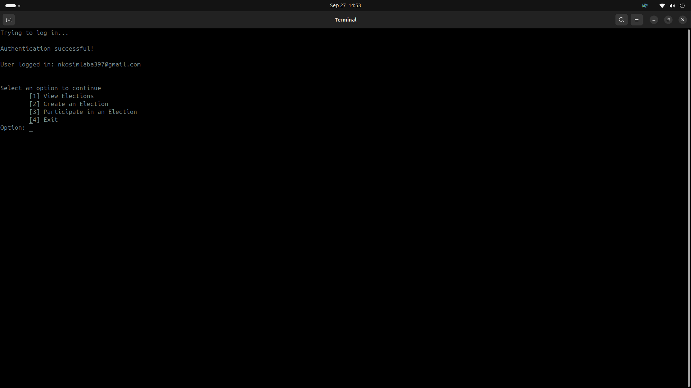

# Voting-Application
An application that allows users to create and participate in polls and elections. The purpose is to gather data. For example creating a poll and allowing students to vote on their favorite programming language.

## Output ([gallery](program-output/Gallery.md))

## Project Status 

1. The core functionality is completed and includes:
    - User authentication with Google Oauth
    - Creating an election
    - Viewing elections, viewing election details
    - Participating in an election
    - User data encryption and decryption
    - Saving election data (JSON for metadata)

2. Additional features that I am looking to have implemented:
    - More robust user interface
    - Using database to store the election data

## Account Requirements:
- A Google email
- A client_secret file from google cloud console <a href="#googlecloud">(instructions)</a>

## System Requirements:
- An internet connection
- A linux based machine
- Terminal
- Python3
- Pip

Additional requirements:
- .env file <a href="#encryption">(instructions)</a>

## Running instructions:
1. Open a terminal in the application's directory

2. Run this command in terminal to install dependencies
    
        pip install -r dependencies/requirements.txt

3. Run this command in terminal --> 
    
        python3 project.py

## Testing instructions:
1. Commands to run tests:
    
        python3 tests/test_project.py
        python3 tests/test_create.py
        python3 tests/test_participate.py
        python3 tests/test_view.py

## Detailed Description:

###### Creating an election involves:
 Naming the election, providing the number of candidates, entering information about each candidate, whether it is a public election or not. For non-public elections only specified people are allowed to vote.

###### Viewing elections involves: 
 Showing the user all available elections and prompting the user for the election they want to view. Details shown about the election include the title, whether the owner is allowed to vote, whether it is a public election, the election creator, the votes for each candidate, and the total votes in the election.

 ###### Participating in an election involves:
  Showing the user available elections and then prompting the user for the election they wish to participate in, the option they want to vote for. Once chosen the voting data is written and the scores are updated automatically.

## Encryption key instructions:

1. Use this command to generate an encryption key:
    
        python3 encrypt/encryption.py
2. Create a .env file in the root of the directory and add the encryption key

        ENCRYPTION_KEY=your_encryption_key

## Obtaining client_secret:

1. Create a Google Cloud Project:

    If you haven't already, navigate to the Google Cloud Console and create a new project. Note down the project ID.
     
2. Set Up OAuth Consent Screen:
    Navigate to the "APIs & Services" > "OAuth consent screen" section.
    Configure the OAuth consent screen with required information such as the application name, user support email, and scopes. Make sure to include the following scope: "https://www.googleapis.com/auth/userinfo.email"
    Save your changes.
     
3. Create OAuth 2.0 Client ID:
    Navigate to the "APIs & Services" > "Credentials" section.
    Click on the "Create credentials" button and select "OAuth client ID" from the dropdown menu.
    Choose the Desktop application.
    Click "Create" to generate your OAuth 2.0 Client ID and client secret.
     
4. Download Client Secret File:
    After creating the OAuth 2.0 Client ID, you'll be provided with a client ID and client secret.
    Click on the download icon next to your client ID to download the client_secret.json file.
    Keep this file secure and do not share it publicly.
     
5. Rename Client Secret File:
    Rename the file to "client_secret.json"
     
6. Place Client Secret File in Project Directory:
    Once downloaded, move the "client_secret.json" file to the appropriate directory which is "VotingApp/authentication/"
     
7. Configure the Project to Use Client Secret:
    The project is configured to run using the client_secret file in the authentication directory.
     
8. Run the Project:
    With the client secret file properly configured, you can now run the project. Follow the project-specific instructions for setting up and running the application.
     

